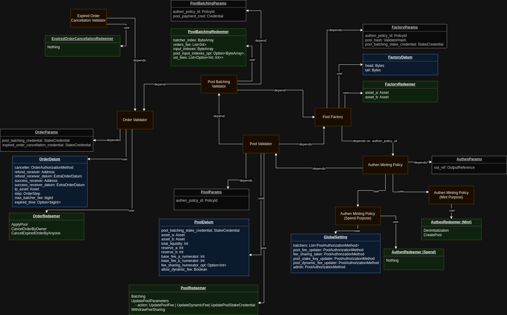

# Minswap AMM V2 Specification

## 1. Overview

- Minswap AMM V2 uses Constant Product Formula (x * y = k). This formula, most simply expressed as x * y = k, states that trades must not change the product (k) of a pair’s reserve balances (x and y). Because k remains unchanged from the reference frame of a trade, it is often referred to as the invariant. This formula has the desirable property that larger trades (relative to reserves) execute at exponentially worse rates than smaller ones.
- The AMM V2 uses Batching architecture to solve concurrency on Cardano. Each user action will create an "Order" and "Batcher" will look through them and apply them into a "Liquidity Pool". A valid "Batcher" is a wallet which contains Minswap's License Token. Batching transaction is permissioned and only is triggered by "Batcher".

## 2. Architecture

There're 5 contracts in the AMM V2 system:

- Order Contract: represents "User Action", contains necessary funds and is waiting to be applied into a Pool
- Order Spending Contract: takes resposibility to verify two Order contract's redeemer
- Pool Contract: a.k.a Liquidity Pool, which holds all User's assets for trading.
- Factory Contract: verify the correctness of Pool Creation. Each Factory UTxO is an element of a Factory `Linked List`
- Authen Minting Policy: is responsible for creating initial Factory `Linked List`, minting legitimate Factory, Liquidity Pool and Liquidity Pool `Share` Tokens

## 3. Specification

### 3.1 Actors

- User: An entity who wants to interact with Liquidity Pool to deposit/withdraw liquidity or swap. The only requirement of users is that they must not be the same as batcher (because of how we filter UTxOs)
- Batcher: An entity who aggregate order UTxOs from users and match them with liquidity pool UTxO. A batcher must hold a batcher's license token. The license token must not be expired and the expired time must be between current time and Maximum Deadline (to prevent minting license with infinity deadline).
- Admin (aka Minswap team): An entity who has permission to update Liquidity Pool's fee, withdraw fee sharing and change the pool's stake address. An Admin must hold an admin's license token.

### 3.2 Tokens

- Factory NFT Token: the Factory legitimate Token, can be only minted in Pool Creation Transaction and cannot be outside Factory Contract. The minting must be followed by rule of `Authen Minting Policy`
   - CurrencySymbol: Authen Minting Policy
   - TokenName: Defined in `Authen Minting Policy` parameters (e.g. "MS")
- Pool NFT token: the Pool legitimate Token, can be only minted in Pool Creation Transaction and cannot be outside Pool Contract. The minting must be followed by rule of `Authen Minting Policy`
   - CurrencySymbol: Authen Minting Policy
   - TokenName: Defined in `Authen Minting Policy` parameters (e.g. "MSP")
- LP token: Represents Liquidity Provider's share of pool. Each pool has a different LP token.
   - CurrencySymbol: Authen Minting Policy
   - TokenName: Hash of Pool's Asset A and Asset B (`SHA_256(SHA_256(AssetA), SHA_256(AssetB))`)
- Batcher license token: Permit batcher to apply pool
   - CurrencySymbol: Defined in Pool parameters. The policy is managed by team (e.g. multisig policy)
   - TokenName: POSIX timestamp represents license deadline
- Admin license token:
   - CurrencySymbol: Defined in Pool parameters. The policy is managed by team (e.g. multisig policy)
   - TokenName: A constant string defined in pool parameters (e.g. "ADMIN")

### 3.3 Smart Contract

#### 3.3.1 Order Spending Validator

Order Spending validator is a Withdrawal Script and takes the responsibility to validate two Order contract's redeemer *ApplyOrder* and *CancelExpiredOrderByAnyone*.
To avoid overlapping validation in each utxo, we forward these conditions to this script and the Order script will rely on it

#### 3.3.1.1 Parameter

- _pool_hash_: the hash of Liquidity Pool Script

#### 3.3.1.2 Redeemer

- **OrderSpendingRedeemer**:
 - _pool_input_index_: Index of Pool UTxO in Transaction Inputs.

#### 3.3.1.3 Validation

- **OrderBatchingRedeemer**: The redeemer contains `pool_input_index`, it's used for finding Pool Input faster
  - In case the inputs at *pool_input_index* is Pool Input (Address's Payment Credential matching with `pool_hash`), the contract is passed and forward the validation to Pool Contract
  - Otherwise, it trigger validation for cancelling expired order:
    - this flow will assume all script inputs are orders and must have the Order datum structure
    - each input must be matched with an output in the same index
    - validate the transaction must be created after expired time
    - validate ADA in the order might be deducted for tipping a canceller. The tip must not exceed the maximum tip and other tokens must be returned to sender
    - If sender is script address, the output have to attach the defined datum

#### 3.3.2 Order Validator

Order validator is responsible for holding "User Requests" funds and details about what users want to do with the liquidity pool. An order can only be applied to the liquidity pool by Batcher or cancelled by User's payment signature / Script Owner Representation (in case Owner is a Smart Contract)

#### 3.3.2.1 Parameter

- _stake_credential_: the Stake Credential of `Order Spending Validator`

#### 3.3.2.2 Datum

There are 10 order types:

- **SwapExactIn**: is used for exchanging specific amount of single asset in the liquidity pool, the order will be executed if the received amount is greater than or equal to `minimum_receive` which is defined below
   - _a_to_b_direction_: The AToB direction of swap request. True for A -> B and False for B -> A
   - _swap_amount_: Amount of Asset In which users want to exchange
   - _minimum_receive_: Minimum amount of Asset Out which users want to receive after exchanging
   - _killable_: Decide the Order behavior in case Order is not meet the slippage tolerance
- **StopLoss**: is used for exchanging specific amount of single asset in the liquidity pool, the order will be executed if the received amount is less than or equal to `stop_loss_receive` which is defined below
   - _a_to_b_direction_: The AToB direction of swap request. True for A -> B and False for B -> A
   - _swap_amount_: Amount of Asset In which users want to exchange
   - _stop_loss_receive_: Maximum amount of Asset Out which users want to receive after exchanging
   - _killable_: Decide the Order behavior in case Order is not meet the slippage tolerance
- **OCO**: is used for exchanging specific amount of single asset in the liquidity pool, the order will be executed if the received amount is less than or equal to `stop_loss_receive` and greater than or equal to `minimum_receive` which are defined below
   - _a_to_b_direction_: The AToB direction of swap request. True for A -> B and False for B -> A
   - _swap_amount_: Amount of Asset In which users want to exchange
   - _minimum_receive_: Minimum amount of Asset Out which users want to receive after exchanging
   - _stop_loss_receive_: Maximum amount of Asset Out which users want to receive after exchanging
   - _killable_: Decide the Order behavior in case Order is not meet the slippage tolerance
- **SwapExactOut**: is used for exchanging single asset in the liquidity pool and receiving the exact amout of other asset, the order will be executed if the received amount is equal to `expected_receive` which is defined below
   - _a_to_b_direction_: The AToB direction of swap request. True for A -> B and False for B -> A
   - _swap_amount_: Amount of Asset In which users want to exchange
   - _expected_receive_: The exact amount of Asset Out which users want to receive after exchanging
   - _killable_: Decide the Order behavior in case Order is not meet the slippage tolerance
- **Deposit**: is used for depositing pool's assets and receiving LP Token
   - _deposit_amount_a_: Amount of Asset A which users want to deposit
   - _deposit_amount_b_: Amount of Asset B which users want to deposit
   - _minimum_lp_: The minimum amount of LP Token which users want to receive after depositing
   - _killable_: Decide the Order behavior in case Order is not meet the slippage tolerance
- **Withdraw**: is used for withdrawing pool's asset with the exact assets ratio of the liquidity pool at that time
   - _withdrawal_lp_amount_: Amount of LP Asset which users want to withdraw 
   - _minimum_asset_a_: minimum received amounts of Asset A.
   - _minimum_asset_b_: minimum received amounts of Asset B.
   - _killable_: Decide the Order behavior in case Order is not meet the slippage tolerance
- **ZapOut**: is used for withdrawing a single pool asset out of Liquidity Pool.
   - _a_to_b_direction_: The AToB direction of ZapOut request. `True` in case Asset Out is B and vice versa
   - _withdrawal_lp_amount_: Amount of LP Asset which users want to withdraw
   - _minimum_receive_: Minimum amount of Asset Out which users want to receive after withdrawing
   - _killable_: Decide the Order behavior in case Order is not meet the slippage tolerance
- **PartialSwap**: is used for exchanging partial amounts of single Asset. The Partial Swap can be executed multiple times if the price ratio is matched with the user's expectation, and the time is defined in `hops`.  
   - _a_to_b_direction_: The AToB direction of swap request. True for A -> B and False for B -> A
   - _total_swap_amount_: Total amount of Asset In which users want to exchange
   - _io_ratio_numerator_ and _io_ratio_denominator_: the price ratio which users want to exchange
   - _hops_: The time PartialSwap can be executed.
   - _minimum_swap_amount_required_: The minimum amount which is required to swap per each execution time.
   - _max_batcher_fee_each_time_: Maximum fee that batcher can take to execute each time
- **WithdrawImbalance**: is used for withdrawing custom amounts of assets.
   - _withdrawal_lp_amount_: Amount of LP Asset which users want to withdraw
   - _ratio_asset_a_ and _ratio_asset_b_: The ratio of Asset A and Asset B users want to receive after withdrawing
   - _minimum_asset_a_: The minimum amount of asset A which users want to receive, The amount of Asset will be followed by the ratio (_received_asset_b_ = _minimum_asset_a_ * _ratio_asset_b_ / _ratio_asset_a_)
   - _killable_: Decide the Order behavior in case Order is not meet the slippage tolerance
- **SwapMultiRouting**: is used for exchanging a specific amount of single asset across multiple Liquidity Pools.
   - _routings_: The routings (including a list of _direction_ and _lp_asset_), which is defined Liquidity Pools the swap is routing through
   - _swap_amount_: Amount of Asset In which users want to exchange
   - _minimum_receive_: Minimum amount of Asset Out which users want to receive after exchanging

An Order Datum keeps information about Order Type and some other informations:

- _sender_: The address of order's creator, only sender can cancel the order
- _sender_datum_hash_: (optional) the datum hash of the output after cancelling order by anyone or killing by batcher.
- _receiver_: The address which receives the funds after order is processed
- _receiver_datum_hash_: (optional) the datum hash of the output after order is processed.
- _lp_asset_: The Liquidity Pool's LP Asset that the order will be applied to
- _step_: The information about Order Type which we mentioned above
- _max_batcher_fee_: The maximum fee users have to pay to Batcher to execute batching transaction. The actual fee Batcher will take might be less than the maximum fee
- _expired_setting_opt_: contain Order Expired time and max tip for cancelling expired order. If the order is not executed after Expired Time, anyone can help the owner cancel it

#### 3.3.2.3 Redeemer

- **ApplyOrder**
- **CancelOrder**
- **CancelExpiredOrderByAnyone**

#### 3.3.2.4 Validation

- **ApplyOrder**: the redeemer will allow spending Order UTxO in Batching transaction
   - validate that an Order can be spent if there's a `Order Spending` validator in the `withdrawals`
- **CancelOrder**: the redeemer will allow _sender_ to spend Order UTxO to get back locked funds.
   - validate that the transaction has _sender_'s signature or _sender_ script UTxO in the Transaction Inputs
- **CancelExpiredOrderByAnyone**: the redeemer will allow anyone to spend Order UTxO to unlock funds going back to user
   - validate that an Order can be spent if there's a `Order Spending` validator in the `withdrawals`

#### 3.3.3 Authen Minting Policy

Authen Minting Policy is responsible for creating initial Factory `Linked List`, minting legitimate Factory, Liquidity Pool and Liquidity Pool `Share` Tokens

#### 3.3.3.1 Parameter

- _out_ref_: is a Reference of an Unspent Transaction Output, which will only be spent on `MintFactoryAuthen` redeemer to make sure this redeemer can only be called once

#### 3.3.3.2 Redeemer
- **MintFactoryAuthen**
- **CreatePool**

#### 3.3.3.3 Validation

- **MintFactoryAuthen**: The redeemer can be called once to initialize the whole AMM V2 system
   - validate that `out_ref` must be presented in the Transaction Inputs
   - validate that there's only 1 Factory UTxO in the Transaction Outputs. The Factory UTxO must contain Factory Token in the value and its datum is:
     - _head_: `#"00"`
     - _tail_: `#"ffffffffffffffffffffffffffffffffffffffffffffffffffffffffffffffff00"`
   - validate that the redeemer only mint **a single Factory Token**
- **CreatePool**:  The redeemer will allow creating a new Liquidity Pool.
   - validate that there's a single Factory UTxO in the Transaction Inputs. Factory UTxO must contain Factory NFT Token in the value
   - validate that transaction only mint 3 types of tokens:
     - 1 Factory NFT Token
     - 1 Pool NFT Token
     - MAX_INT64 LP Token, LP Token must have PolicyID is **AuthenMintingPolicy** and TokenName is Hash of Pool's Asset A and Asset B (`SHA_256(SHA_256(AssetA), SHA_256(AssetB))`). Asset A and Asset B are in Factory Redeemer and they must be sorted

#### 3.3.4 Factory Validator

Factory Validator is responsible for creating a non-duplicated Liquidity Pool. Each Factory UTxO is an element of Factory `Linked List`, contains a head and tail which are existing Pool's LP Asset Token Name except `#"00"` and `#"ffffffffffffffffffffffffffffffffffffffffffffffffffffffffffffffff00"` aka intial head and tail

The Linked List structure is
(`#"00"`, tail 0)

(head 1, tail 1), tail 0 == head 1

(head 2, tail 2), tail 1 == head 2

...

(head n-1, tail n-1)

(head n, `#"ffffffffffffffffffffffffffffffffffffffffffffffffffffffffffffffff00"`)

Anytime new Pool is created, a Factory UTxO will be spent can create the 2 new ones, which is followed by:

- (old head, old tail) -> (old head, Pool LP Token Name) and (Pool LP Token Name, old tail)

- old head < Pool LP Token Name < old tail

#### 3.3.4.1 Parameter

- _authen_policy_id_: The PolicyID of `Authen Minting Policy`
- _pool_hash_: ValidatorHash of Pool Contract

#### 3.3.4.2 Datum
- _head_: The Head of Factory `LinkedList`` element
- _tail_: The Head of Factory `LinkedList`` element

#### 3.3.4.3 Redeemer
 - **Factory Redeemer**:
   - _asset_a_: Asset A of new Liquidity Pool
   - _asset_b_: Asset B of new Liquidity Pool

#### 3.3.4.4 Validation
- **Factory Redeemer**:
   - validate that Asset A and Asset B must be sorted
   - validate that there's single Factory UTxO in Transaction Input and contain single legitimate Factory NFT Token
   - validate that there are only 2 Factory UTxOs in Transaction Outputs, they must contain a single legitimate Factory NFT Token.
   - validate that new Factory UTxO datum must be followed by Linked List rule
   - validate that there is a new Pool UTxO in Transaction Outputs. Pool UTxO must contain single Pool NFT Token
   - Pool Datum must have correct data:
     - _asset_a_ and _asset_b_ must be the same with Factory Redeemer
     - _total_liquidity_ must be sqrt(_amount_a_ * _amount_b_)
     - _reserve_a_ and _reserve_b_ must be _amount_a_ and _amount_b_
     - _trading_fee_percentage_ must be between **0.05%** and **10%**
     - _profit_sharing_ must be empty
   - Pool Value must only have necessary Token: Asset A, Asset B, remaining LP Token (_MAX_INT64_ - _total_liquidity_), 1 Pool NFT Token and 3 ADA (required ADA for an UTxO)
   - validate that transaction only mint 3 types of tokens:
     - 1 Factory NFT Token
     - 1 Pool NFT Token
     - MAX_INT64 LP Token, LP Token must have PolicyID is **AuthenMintingPolicy** and TokenName is Hash of Pool's Asset A and Asset B (`SHA_256(SHA_256(AssetA), SHA_256(AssetB))`). Asset A and Asset B are in Factory Redeemer and they must be sorted

#### 3.3.5 Pool Validator

Pool validator is the most important part in the system. It's responsible for guaranteeing that Orders must be processed in the correct way and Liquidity Providers' funds cannot be stolen in any way.

#### 3.3.5.1 Parameter

- _authen_policy_id_: The PolicyID of `Authen Minting Policy`

#### 3.3.5.2 Datum
- _asset_a_: The Pool's Asset A
- _asset_b_: The Pool's Asset B
- _total_liquidity_: Total Share of Liquidity Providers
- _reserve_a_: Asset A's balance of Liquidity Providers
- _reserve_b_: Asset B's balance of Liquidity Providers
- _trading_fee_numerator_: Numerator of Trading Fee
- _trading_fee_denominator_: Denominator of Trading Fee
- _profit_sharing_opt_: (Optional) Numerator and Denominator of Profit Sharing percentage, this is the percentage of Trading Fee. (eg, Trading Fee is 3%, Profit Sharing is 1/6 -> Profit Sharing = 1/6 * 3%)

#### 3.3.5.3 Redeemer
 - **Batching**:
   - _batcher_address_: Address of Batcher
   - _input_indexes_: The Indexes of Orders are processing (it will be explained below)
   - _orders_fee_: The list of batcher fee will be deducted from orders' fund. Batcher can decide the amount of fee for each orders. The Batcher Fee can not exceed the maximum batcher fee.
   - _license_index_: Index of the UTxO holding Batcher License Token in the Transaction Inputs.
 - **MultiRouting**:
   - _batcher_address_: Address of Batcher
   - _license_index_: Index of the UTxO holding Batcher License Token in the Transaction Inputs.
   - _routing_in_indexes_: Indexes of Pool UTxOs in the Transaction Inputs
   - _routing_out_indexes_: Indexes of Pool UTxOs in the Transaction Outputs
   - _order_fee_: Batcher fee will be deducted from orders' fund. Batcher can decide the amount of fee for each orders. The Batcher Fee can not exceed the maximum batcher fee.
 - **UpdatePoolFeeOrStakeCredential**:
   - _action_: There are 2 actions in this redeemer.
     - _UpdatePoolFee_: Allow Admin to update Liquidity Pool's fee (Trading Fee and Profit Sharing).
     - _UpdatePoolStakeCredential_: Allow Admin update Pool's Stake Credential. It allows Minswap can delegate Liquidity Pool's ADA to different Stake Pools
   - _admin_index_: Index of the UTxO holding Admin License Token in the Transaction Inputs.
 - **WithdrawLiquidityShare**:
   - _admin_index_: Index of the UTxO holding Admin License Token in the Transaction Inputs.

#### 3.3.5.4 Validation
- **Batching**: This redeemer will be called on Batching Transaction. It can process all types of Orders except **SwapMultiRouting** Order
   - validate batcher with valid License Token must be presented in Transaction Inputs:
     - Batcher must sign a Batching transaction.
     - A valid license token is the token having expired timestamp as TokenName and must be within current time and current time + _maximum_deadline_range_
   - validate _input_indexes_ must not be empty and be unique list
   - validate Transaction won't mint any assets
   - validate there is a single Pool UTxO in both Transaction Inputs and Outputs and must have the same Address (both Payment and Stake Credential)
   - validate all fields in Pool Datum must not be changed except _total_liquidity_, _reserve_a_ and _reserve_b_
   - validate Pool Input / Output Value contain necessary assets:
     - 3 ADA
     - Asset A
     - Asset B
     - LP Token
     - Pool NFT Token
   - validate the Pool State (_datum_reserve_a_, _datum_reserve_b_, _value_reserve_a_, _value_reserve_b_, _total_liquidity_) must be the same with the calculated amount after applying through all orders:
     - The validator will loop through the list of batch inputs and outputs and validate each one, as well as calculate the final state of the pool.
     - Important note that order inputs are sorted lexicographically due to Cardano ledger's design, so the Batcher will pre-calculate correct order inputs indexes, pass through the redeemer (_input_indexes_) and validator will sort the Order Inputs with the indexes to make sure that Orders will be processed with FIFO ordering
     - Each order must validate:
       - All amount fields in Order Step must be positive
       - _batcher_fee_ must be positive
       - _lp_asset_ in **OrderDatum** must be the same with processing Liquidity Pool
       - Order Output must be returned to _receiver_ and might have _receiver_datum_hash_opt_
       - Order Output value must satisfy the condition of [description in Order Datum](#3322-datum)
- **MultiRouting**: This redeemer will be called on MultiRouting Transaction. It will process single **SwapMultiRouting** Order and multiple **Liquidity Pool**
   - validate batcher with valid License Token must be presented in Transaction Inputs:
     - Batcher must sign a Batching transaction.
     - A valid license token is the token having expired timestamp as TokenName and must be within current time and current time + _maximum_deadline_range_
   - validate _routing_in_indexes_ and _routing_out_indexes_ must be unique, have the same length and contain more than 1 element.
   - validate Transaction won't mint any assets
   - validate the number of Pool Inputs and Pool Outputs must be _routing_in_indexes_ length. and each Pool Input must have the same Address with Pool Output (both Payment and Stake Credential)
   - validate all fields in each Pool Datum must not be changed except _reserve_a_ and _reserve_b_
   - validate each Pool Input / Output Value contain necessary assets:
     - 3 ADA
     - Asset A
     - Asset B
     - LP Token
     - Pool NFT Token
   - validate transaction must have single **SwapMultiRouting** Order and:
     - All amount fields in Order Step must be positive
     - _batcher_fee_ must be positive
     - _lp_asset_ in **OrderDatum** must be the same with LP Asset of first Liquidity Pool in routing list
     - Order Output must be returned to _receiver_ and might having _receiver_datum_hash_opt_
     - The number of Pool Inputs and Pool Outputs must be the same with _routings_ length
     - Calculated Asset Out must be returned to _receiver_
     - Order Output value must satisfy the condition of [description in Order Datum](#3322-datum)
- **UpdatePoolFeeOrStakeCredential**: Allow Admin update Liquidity Pool's fee (Trading Fee and Profit Sharing) or update Pool's Stake Credential. It allows Minswap can delegate Liquidity Pool's ADA to different Stake Pools
   - validate Admin with valid Admin License Token must be presented in Transaction Inputs
   - validate there is a single Pool UTxO in Transaction Inputs and single Pool UTxO in Transaction Outputs and:
     - Pool Input contains 1 valid Pool NFT Token
     - Pool Input and Output Value must be unchanged
     - Transaction contain only 1 Script (Pool Script). It will avoid bad Admin stealing money from Order Contract.
   -  validate Transaction won't mint any assets
   -  Both **UpdatePoolFeeOrStakeCredential** _action_ must not change these fields on the Pool Datum:
      -  _asset_a_
      -  _asset_b_
      -  _total_liquidity_
      -  _reserve_a_
      -  _reseve_b_
   -  Each _action_ must be followed:
      -  _UpdatePoolFee_:
            - Trading Fee must be between **0.05%** and **10%**
            - Profit Sharing can be on/off by setting _profit_sharing_opt_ is None or Some. Profit Sharing must be between **16.66%** and **50%**
            - Pool Address must be unchanged (both Payment and Stake Credential)
      - _UpdatePoolStakeCredential_:
        - Trading Fee and Profit Sharing must be unchanged
        - Pool's Stake Credential can be changed to any other Stake Address
- **WithdrawLiquidityShare**: Allow Admin can withdraw Liquidity Share to any Addresss.
   - validate Admin with valid Admin License Token must be presented in Transaction Inputs.
   - validate there is a single Pool UTxO in Transaction Inputs and single Pool UTxO in Transaction Outputs and:
     - Pool Input contains 1 valid Pool NFT Token
     - Pool Input and Output Address must be unchanged (both Payment and Stake Credential)
     - Pool Datum must be unchanged
     - Transaction contain only 1 Script (Pool Script). It will avoid bad Admin stealing money from Order Contract.
   - validate Transaction won't mint any assets
   - validate Admin withdraws the exact earned Profit Sharing amount:
     - Earned Asset A: Reserve A in Value - Reserve A in Datum
     - Earned Asset B: Reserve B in Value - Reserve B in Datum
   - validate Pool Out Value must be Pool In Value sub Earned Asset A and Earned Asset B

### 3.4 Transaction

### 3.4.1 Initialize Factory Linked List

AMM V2 requires a Factory Linked List, and the initial Linked List contains 1 element with head `#"00"` and tail `#"ffffffffffffffffffffffffffffffffffffffffffffffffffffffffffffffff00"`.

Transaction requires spending a Unspent Transaction Output which is defined on `Authen Minting Policy`

Transaction structure:
 - Inputs:
   - an UTxO which is defined in Authen Minting Policy (see @out_ref of AuthenMinting Policy in Section 3.3.3.1)
 - Mint:
   - Script Authen Minting Policy:
     - Redeemer: MintFactoryAuthen
     - Value: 1 Factory NFT Asset
 - Outputs:
   - a Factory UTxO:
       - Address: Factory Address
       - Datum:
           - head: #"00"
           - tail: #"ffffffffffffffffffffffffffffffffffffffffffffffffffffffffffffffff00
       - Value:
         - minimum ADA
         - 1 Factory NFT Asset
   - Change UTxOs

### 3.4.2 Create Liquidity Pool

In order to create Liquidity Pool, transaction requires a Factory UTxO that has suitable head and tail and `head < SHA_256(SHA_256(Token A), SHA_256(Token B)) < tail`

Transaction structure:
 - Inputs:
   - UTxOs holding Token A and Token B
   - a Factory UTxO we mentioned above
     - Address: Factory Address
     - Datum:
       - head (0)
       - tail (1)
     - Value:
       - minimum ADA
       - 1 Factory NFT Asset
     - Redeemer:
       - FactoryRedeemer:
         - Token A (2)
         - Token B (3)
 - Mint:
   - Script Authen Minting Policy
     - Redeemer: Create Pool
     - Value:
       - 1 Pool NFT Asset
       - 1 Factory NFT Asset
       - MAX_INT64 LP Asset
 - Outputs:
   - a Factory UTxO:
       - Address: Factory Address
       - Datum:
           - head: head (0)
           - tail: SHA_256(SHA_256(Token A), SHA_256(Token B))
       - Value:
         - minimum ADA
         - 1 Factory Asset
   - a Factory UTxO:
       - Address: Factory Address
       - Datum:
           - head: SHA_256(SHA_256(Token A), SHA_256(Token B))
           - tail: tail (1)
       - Value:
         - minimum ADA
         - 1 Factory Asset
   - a Pool UTxO:
     - Address: Pool Address
     - Value:
       - 3 ADA
       - x (4) Token A
       - y (5) Token B
       - 1 Pool NFT Asset
       - LP Asset (followed by OnChain calculation)
     - Datum:
       - asset_a: Token A (2)
       - asset_b: Token B (3)
       - total_liquidity: Followed by OnChain calculation
       - reserve_a: x (4)
       - reserve_b: y (5)
       - trading_fee_numerator: Followed by OnChain validation
       - trading_fee_denominator: Followed by OnChain validation
       - profit_sharing_opt: None
   - Change UTxOs

### 3.4.3 Create Order

Create Order transaction will transfer User funds into an Order UTxO.

Besides common information such as _sender_, _receiver_, etc, each order type requires different information in _step_ field (note that we only mention _field name_ here, the fields' descriptions have been explained above)

Transaction structure:
 - Inputs: User's UTxOs
 - Outputs:
   - Order UTxOs (a single transaction can create multiple orders)
     - Address: Order Address
     - Datum:
       - _sender_
       - _receiver_
       - _receiver_datum_hash_
       - _lp_asset_
       - _batcher_fee_
       - _expired_setting_opt_
       - _step_:
         - _SwapExactIn_:
           - Step:
             - _a_to_b_direction_
             - _swap_amount_
             - _minimum_receive_([Formula](./formula.md#1-swap-exact-in))
             - _killable_
           - Value:
             - _batcher_fee_ + additional ADA to cover output (if need)
             - Token is swapping
         - _StopLoss_:
           - Step:
             - _a_to_b_direction_
             - _swap_amount_
             - _stop_loss_receive_([Formula](./formula.md#1-swap-exact-in))
             - _killable_
           - Value:
             - _batcher_fee_ + additional ADA to cover output (if need)
             - Token is swapping
         - _OCO_:
           - Step:
             - _a_to_b_direction_
             - _swap_amount_
             - _minimum_receive_([Formula](./formula.md#1-swap-exact-in))
             - _stop_loss_receive_([Formula](./formula.md#1-swap-exact-in))
             - _killable_
           - Value:
             - _batcher_fee_ + additional ADA to cover output (if need)
             - Token is swapping
         - _SwapExactOut_:
           - Step:
             - _a_to_b_direction_
             - _maximum_swap_amount_([Formula](./formula.md#2-swap-exact-out))
             - _expected_receive_
             - _killable_
           - Value:
             - _batcher_fee_ + additional ADA to cover output (if need)
             - Token is swapping
         - _Deposit_:
           - Step:
             - _deposit_amount_a_
             - _deposit_amount_b_
             - _minimum_lp_([Formula](./formula.md#3-deposit))
           - Value:
             - _batcher_fee_ + additional ADA to cover output (if need)
             - Token A and Token B (amount of token A or B can be zero)
         - _Withdraw_:
           - Step:
             - _withdrawal_lp_amount_
             - _minimum_asset_a_([Formula](./formula.md#4-withdraw))
             - _minimum_asset_b_([Formula](./formula.md#4-withdraw))
             - _killable_
           - Value:
             - _batcher_fee_ + additional ADA to cover output (if need)
             - LP Asset
         - _ZapOut_:
           - Step:
             - _a_to_b_direction_
             - _withdrawal_lp_amount_
             - _minimum_receive_([Formula](./formula.md#5-zap-out))
             - _killable_
           - Value:
             - _batcher_fee_ + additional ADA to cover output (if need)
             - LP Asset
         - _WithdrawImbalance_:
           - Step:
             - _withdrawal_lp_amount_
             - _ratio_asset_a_
             - _ratio_asset_b_
             - _minimum_asset_a_([Formula](./formula.md#6-withdraw-imbalance))
             - _killable_
           - Value:
             - _batcher_fee_ + additional ADA to cover output (if need)
             - LP Asset
         - _PartialSwap_:
           - Step:
             - _a_to_b_direction_([Formula](./formula.md#7-partial-swap))
             - _total_swap_amount_
             - _io_ratio_numerator_([Formula](./formula.md#7-partial-swap))
             - _io_ratio_denominator_([Formula](./formula.md#7-partial-swap))
             - _hops_([Formula](./formula.md#7-partial-swap))
             - _minimum_swap_amount_required_([Formula](./formula.md#7-partial-swap))
             - _max_batcher_fee_each_time_
           - Value:
             - _batcher_fee_ * _hops_ + additional ADA to cover output (if need)
             - Token is swapping and received Token of previous swap (if you are order's creator, you no need to care about _received Token_)
         - _SwapMultiRouting_:
           - Step:
             - _routings_([Formula](./formula.md#1-swap-exact-in))
             - _swap_amount_
             - _minimum_receive_([Formula](./formula.md#1-swap-exact-in))
           - Value:
             - _batcher_fee_ + additional ADA to cover output (if need)
             - Token is swapping
   - Change UTxOs

### 3.4.4 Batching

Batching transaction is the most complex structure.

It requires a Pool UTxO, Batcher UTxOs (must include Batcher License Token) and Order UTxOs which are applying to the Pool UTxO

Transaction structure:
 - Inputs:
   - Order UTxOs (see Section 3.4.3) except _SwapMultiRouting_ Order
   - Batcher UTxO
     - Address: Batcher Address
     - Value:
       - ADA
       - 1 Batcher License Token (which is not expired)
   - Pool UTxO
     - Address: Pool Address
     - Value:
       - 3 ADA
       - Token A
       - Token B
       - LP Token
       - 1 Pool NFT Token
     - Datum:
       - _asset_a_
       - _asset_b_
       - _total_liquidity_
       - _reserve_a_
       - _reserve_b_
       - _trading_fee_numerator_
       - _trading_fee_denominator_
       - _profit_sharing_opt_
     - Redeemer: Batching
       - _batcher_address_
       - _input_indexes_
       - _license_index_
 - Outputs:
   - a Pool Output
     - Address: Pool Address (unchanged)
     - Value: (followed by OnChain calculation)
       - 3 ADA
       - Token A
       - Token B
       - LP Token
       - 1 Pool NFT Token
     - Datum:
       - _asset_a_ (unchanged)
       - _asset_b_ (unchanged)
       - _total_liquidity_
       - _reserve_a_ (followed by OnChain calculation)
       - _reserve_b_ (followed by OnChain calculation)
       - _trading_fee_numerator_ (unchanged)
       - _trading_fee_denominator_ (unchanged)
       - _profit_sharing_opt_ (unchanged)
   - Order Outputs:
     - Address: _receiver_
     - DatumHash: _receiver_datum_hash_opt_
     - Value:
       - _SwapExactIn_:
         - Value:
           - change in ADA
           - Received Token (must be greater than or equal to _minimum_receive_)
       - _StopLoss_:
         - Value:
           - change in ADA
           - Received Token (must be less than or equal to _stop_loss_receive_)
       - _OCO_:
         - Value:
           - change in ADA
           - Received Token (must be less than or equal to _stop_loss_receive_ and greater than or equal to _minimum_receive_)
       - _SwapExactOut_:
         - Value:
           - change in ADA
           - Received Token (must be equal to _expected_receive_)
           - Change of Swapping Token (if have)
       - _Deposit_:
         - Value:
           - change in ADA
           - LP Token (must be greater than or equal to _minimum_lp_)
       - _Withdraw_:
         - Value:
           - change in ADA
           - Token A (must be greater than or equal to _minimum_asset_a_)
           - Token B (must be greater than or equal to _minimum_asset_b_)
       - _ZapOut_:
         - Value:
           - change in ADA
           - Received Token (must be greater than or equal to _minimum_receive_)
       - _WithdrawImbalance_:
         - Value:
           - change in ADA
           - Token A (must be greater than or equal to _minimum_asset_a_)
           - Token B (must be greater than or equal to _minimum_asset_a_ * _ratio_asset_b_ / _ratio_asset_a_)
       - _PartialSwap_: partial is more complex, the result has 2 cases
         - Return all the funds to _receiver_ if _hops_ = 1 or remaining Swapping Token is less than _minimum_swap_amount_required_
           - Value:
             - _batcher_fee_ * (_hops_ - 1) + change in ADA
             - remaining swapping Token and received Token
         - Create new _PartialSwap_ Order if _hops_ > 1 and remaining Swapping Token is greater than _minimum_swap_amount_required_
           - Datum:
             - _sender_ (unchanged)
             - _receiver_ (unchanged)
             - _receiver_datum_hash_ (unchanged)
             - _lp_asset_ (unchanged)
             - _batcher_fee_ (unchanged)
             - _step_: _PartialSwap_
               - _a_to_b_direction_ (unchanged)
               - _total_swap_amount_: old _total_swap_amount_ - _swaped_amount_ in this hop 
               - _io_ratio_numerator_ (unchanged)
               - _io_ratio_denominator_ (unchanged)
               - _hops_: _old_hops_ - 1
               - _minimum_swap_amount_required_ (unchanged)
           - Value:
             - _batcher_fee_ * (_hops_ - 1) + change in ADA
             - remaining swapping Token and received Token
   - Batcher Change UTxOs

### 3.4.5 Multi Routing

Transaction allows an _SwapMultiRouting_ Order is processed through multiple Liquidity Pools

Transaction structure:
 - Inputs:
   - Order UTxO (see Section 3.4.3)
   - Pool UTxOs
     - Address: Pool Address
     - Value:
       - 3 ADA
       - Token A
       - Token B
       - LP Token
       - 1 Pool NFT Token
     - Datum:
       - _asset_a_
       - _asset_b_
       - _total_liquidity_
       - _reserve_a_
       - _reserve_b_
       - _trading_fee_numerator_
       - _trading_fee_denominator_
       - _profit_sharing_opt_
     - Redeemer: MultiRouting
       - _batcher_address_
       - _license_index_
       - _routing_in_indexes_
       - _routing_out_indexes_
   - Batcher UTxO
     - Address: Batcher Address
     - Value:
       - ADA
       - 1 Batcher License Token (which is not expired)
 - Outputs:
   - Pool Outputs:
     - Address: Pool Address (unchanged)
     - Value: (followed by OnChain calculation)
       - 3 ADA
       - Token A
       - Token B
       - LP Token (unchanged)
       - 1 Pool NFT Token
     - Datum:
       - _asset_a_ (unchanged)
       - _asset_b_ (unchanged)
       - _total_liquidity_ (unchanged)
       - _reserve_a_ (followed by OnChain calculation)
       - _reserve_b_ (followed by OnChain calculation)
       - _trading_fee_numerator_ (unchanged)
       - _trading_fee_denominator_ (unchanged)
       - _profit_sharing_opt_ (unchanged)
   - Order Output
     - Address: _receiver_
     - DatumHash: _receiver_datum_hash_opt_
     - Value:
       - change in ADA
       - Received Token (must be greater than or equal to _minimum_receive_)
   - Batcher Change UTxOs

### 3.4.5 Update Pool Fee Or Stake Credential

Transaction structures:
 - Inputs:
   - Admin UTxO:
     - Address: Admin Address
     - Value:
       - ADA
       - 1 Admin License Token
   - Pool UTxO:
     - Address: Pool Address
     - Value: 
       - 3 ADA
       - Token A
       - Token B
       - LP Token
       - 1 Pool NFT Token
     - Datum:
       - _asset_a_
       - _asset_b_
       - _total_liquidity_
       - _reserve_a_
       - _reserve_b_
       - _trading_fee_numerator_
       - _trading_fee_denominator_
       - _profit_sharing_opt_
     - Redeemer: UpdatePoolFeeOrStakeCredential
       - _action_
       - _admin_index_
 - Outputs:
   - Pool Output:
     - Address: if _action_ is:
       - _UpdatePoolFee_: unchanged
       - _UpdatePoolStakeCredential_: only change Stake Credential
     - Value: (unchanged)
     - Datum: if _action_ is:
       - _UpdatePoolFee_: only change:
         -  _trading_fee_numerator_
         -  _trading_fee_denominator_
         -  _profit_sharing_opt_
       - _UpdatePoolStakeCredential_: unchanged
   - Admin Change UTxOs

### 3.4.6 Withdraw Liquidity Share

Transaction structures:
 - Inputs:
   - Admin UTxO:
     - Address: Admin Address
     - Value:
       - ADA
       - 1 Admin License Token
   - Pool UTxO:
     - Address: Pool Address
     - Value: 
       - 3 ADA
       - Token A
       - Token B
       - LP Token
       - 1 Pool NFT Token
     - Datum:
       - _asset_a_
       - _asset_b_
       - _total_liquidity_
       - _reserve_a_
       - _reserve_b_
       - _trading_fee_numerator_
       - _trading_fee_denominator_
       - _profit_sharing_opt_
     - Redeemer: WithdrawLiquidityShare
       - _admin_index_
 - Outputs:
   - Pool Output:
     - Address: (unchanged)
     - Value: old Value - Fee Sharing
     - Datum: (unchanged)
   - Admin Change UTxOs

